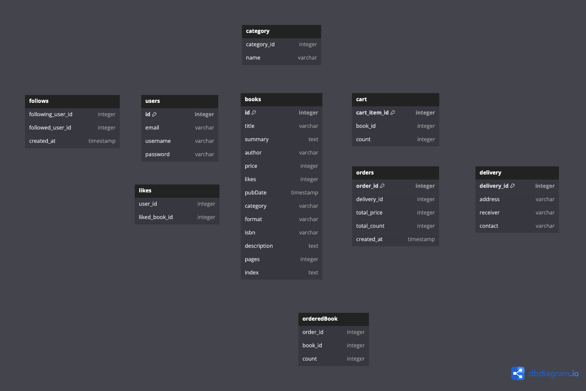

# 7주차_Day2
Node.js book-shop 프로젝트 시작

## 진행 사항
- 프로젝트 세팅
  - app.js에서 express 서버 열기 및 상위 경로 생성
  - routes 폴더에 하위 경로 모듈 생성
    - users.js
    - books.js
    - likes.js
    - carts.js
    - orders.js
- ERD 생성
  - 테이블 작성
- postman 워크스페이스 생성
- sql workbench 생성
  - 스키마 및 user 테이블 생성

<br>

# express-generator의 프로젝트 구조
### bin/www
- 웹 서버 구축에 필요한 설정 데이터 정의된 파일 (에러 처리 등)
### node_modules
- 모듈 설치되는 폴더
### public
- images / javascripts / stylesheets
- 정적 파일을 담아두는 폴더 
### routes
- 각 경로 담당 모듈을 담아두는 폴더 (로직 파일별로 분할)
- 자바의 controller 역할
### app.js
- 서버의 시작점으로, URL에 따라서 라우팅하는 파일
### views
- 클라이언트에게 html 전송 파일 보관하는 폴더
### package.json
- 프로젝트에 설치된 모듈의 목록과 버전

<br>

# express.json()
```js
const express = require('express');
const router = express.Router();

router.use(express.json());
```
- express 환경에서 JSON 형식의 요청 본문을 자동으로 JavaScript 객체 파싱하는 `express.json()` 미들웨어를 라우터에 적용
- 해당 미들웨어 적용하지 않을 경우 요청 본문 문자열 형태로 들어오기 때문에 post 요청에서 req.body 활용하기 위해 파싱 필요

<br>

# 프로젝트 ERD
